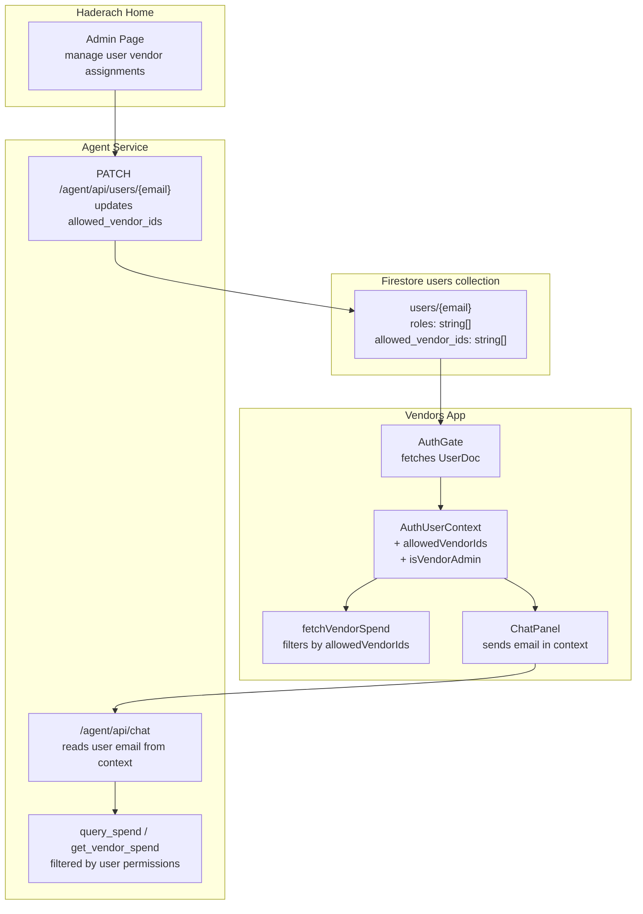

## Context

Currently, any user with vendors app access sees **all** vendor spend data. The business requires vendor-level permissioning: users should only see spend for vendors they are explicitly authorized to view.

### Decisions (from requirements discussion)

- **`vendor_admin`** role (new) bypasses filtering and sees all vendor spend. Regular `admin` is subject to filtering.
- `member` and `vendors_member` are subject to vendor-level filtering.
- **Enforcement is client-side** (Firestore rules stay as-is for now).
- **Vendor list/detail views are unrestricted** -- filtering applies only to spend data.
- **Agent chat** must also respect vendor visibility.
- **Admin page** for managing vendor-to-user assignments will be added to haderach-home.

## Plan

Full implementation plan: `.cursor/plans/vendor_spend_access_control_56fd220f.plan.md`

## Architecture



## Workstream 1: Schema and Role Changes

### 1a. New field: `allowed_vendor_ids` on user documents

Add an `allowed_vendor_ids` array field (list of vendor Firestore doc IDs) to user documents. Empty array or missing field = no vendor spend access (unless `vendor_admin`).

### 1b. New role: `vendor_admin`

Introduce `vendor_admin` as a recognized role. Users with this role bypass vendor-level filtering and see all spend.

### Files to change

- `haderach-platform/scripts/seed-users.py` -- add `vendor_admin` role to appropriate seed users; add example `allowed_vendor_ids` entries
- `haderach-home/packages/shared-ui/src/auth/app-catalog.ts` -- add `vendor_admin` to `APP_GRANTING_ROLES.vendors` so vendor admins can access the app
- `haderach-platform/docs/architecture.md` -- document the new field and role in the RBAC section

## Workstream 2: Vendors App -- Spend Filtering

### 2a. Extend `UserDoc` and `AuthUserContext`

- `vendors/src/auth/accessPolicy.ts` -- add `allowedVendorIds: string[]` to `UserDoc` interface; read `allowed_vendor_ids` from Firestore doc in `fetchUserDoc()`
- `vendors/src/auth/AuthUserContext.ts` -- add `allowedVendorIds: string[]` and `isVendorAdmin: boolean` to `AuthUser` interface
- `vendors/src/auth/AuthGate.tsx` -- pass `allowedVendorIds` and `isVendorAdmin` (derived from `roles.includes('vendor_admin')`) into the context provider

### 2b. Filter spend data

- `vendors/src/fetchVendorSpend.ts` -- accept an optional `allowedVendorIds` parameter; if provided and non-empty, add an additional filter so only matching vendors' spend rows are returned
- `vendors/src/App.tsx` -- read `allowedVendorIds` and `isVendorAdmin` from `useAuthUser()`; pass `allowedVendorIds` to `fetchVendorSpend()` (pass `undefined` if `isVendorAdmin`)
- The `Controls` component's vendor multi-select in spending view should also be filtered to only show vendors the user is allowed to see spend for

### Key code change (fetchVendorSpend.ts)

Current filtering at line 46 only checks `spendKeySet`. The change adds:

```typescript
if (allowedVendorIds && !allowedVendorIds.includes(d.vendorId)) continue;
```

## Workstream 3: Agent Chat -- User-Scoped Spend Filtering

### 3a. Pass user identity from vendors app to agent

- `vendors/src/ChatPanel.tsx` -- import `useAuthUser`, add `email` to the `context` object sent with chat requests:

```typescript
context: { app: 'vendors', userEmail: authUser.email }
```

### 3b. Agent reads user permissions and filters spend

- `agent/service/app.py` -- in the `/chat` handler, extract `userEmail` from `req.context`; load `allowed_vendor_ids` from the user's Firestore doc; pass allowed IDs to tool handlers
- `agent/service/firestore_client.py` -- add a `get_user_allowed_vendors(email)` helper that reads a user doc and returns their `allowed_vendor_ids` and whether they have `vendor_admin` role
- `agent/service/tools.py` -- modify `execute_query_spend()` and `execute_search_vendors()` to accept and apply an `allowed_vendor_ids` filter; if provided, exclude vendors not in the list from results

## Workstream 4: Admin Page in Haderach Home

### 4a. Add API endpoint for managing vendor permissions

- `agent/service/app.py` -- add `PATCH /agent/api/users/{email}` endpoint that accepts `{ allowed_vendor_ids: string[] }` and updates the user doc using Admin SDK (bypasses Firestore client-write rules)
- Consider also adding `GET /agent/api/users` (list all users) and `GET /agent/api/vendors` (list vendor IDs/names for the picker) -- the users endpoint already exists with `?role=` filter; may need an unfiltered variant

### 4b. Add client-side routing to haderach-home

- Add `react-router-dom` dependency to `haderach-home/package.json`
- `haderach-home/src/main.tsx` -- wrap `App` in `BrowserRouter`
- `haderach-home/src/App.tsx` -- add `Routes` with `/` (existing landing) and `/admin/users` (new admin page)

### 4c. Build the admin page

- New file: `haderach-home/src/pages/AdminUsers.tsx` -- a page that:
  - Lists all users (fetched from `GET /agent/api/users`)
  - For each user, shows their current `allowed_vendor_ids`
  - Provides a vendor multi-select picker (fetches vendor list from `GET /agent/api/vendors` or reads Firestore `vendors` collection)
  - Saves changes via `PATCH /agent/api/users/{email}`
  - Only accessible to users with `admin` or `vendor_admin` role (gated in the route)

### 4d. Navigation

- `haderach-home/packages/shared-ui/src/components/GlobalNav.tsx` -- add an optional "Admin" link (gear icon or text) visible only when the user has `admin` or `vendor_admin` role; links to `/admin/users`
- Alternatively, add it as a nav item within the admin page itself rather than modifying GlobalNav

### 4e. Platform routing

- `haderach-platform/firebase.json` -- add SPA fallback rewrite for `/admin/**` paths so they resolve to haderach-home's `index.html`

## Workstream 5: Documentation

- `haderach-platform/docs/architecture.md` -- update RBAC section to document `vendor_admin` role and `allowed_vendor_ids` field
- `vendors/docs/architecture.md` -- document the spend filtering behavior

## Implementation Order

Recommended order to keep changes testable:

1. **Workstream 1** (schema/role) -- seed data, update app-catalog
2. **Workstream 2** (vendors app filtering) -- can test immediately with manually set `allowed_vendor_ids` in Firebase Console
3. **Workstream 3** (agent chat filtering) -- builds on workstream 1
4. **Workstream 4** (admin page) -- largest piece; builds on workstreams 1 and 3 for the API
5. **Workstream 5** (docs) -- finalize after implementation

## Scope Notes

- Firestore security rules are **not** being changed (client-side enforcement only, per requirements)
- Vendor list and vendor detail views remain **unrestricted** -- only spend data is filtered
- The admin page lives in **haderach-home** (platform hub), not in the vendors app
- `vendor_admin` is a **new role** that needs to be assigned to appropriate users

## Acceptance Criteria

- Users with `vendor_admin` role see all vendor spend data without restriction
- Users with `admin`, `member`, or `vendors_member` roles only see spend for vendors listed in their `allowed_vendor_ids`
- Users with no `allowed_vendor_ids` (and without `vendor_admin`) see no spend data
- The vendor multi-select in the spending view only shows vendors the user is allowed to see
- Agent chat responses respect the same vendor-level filtering as the UI
- An admin page in haderach-home allows `admin` or `vendor_admin` users to manage vendor assignments per user
- Documentation is updated in both platform and vendors architecture docs
